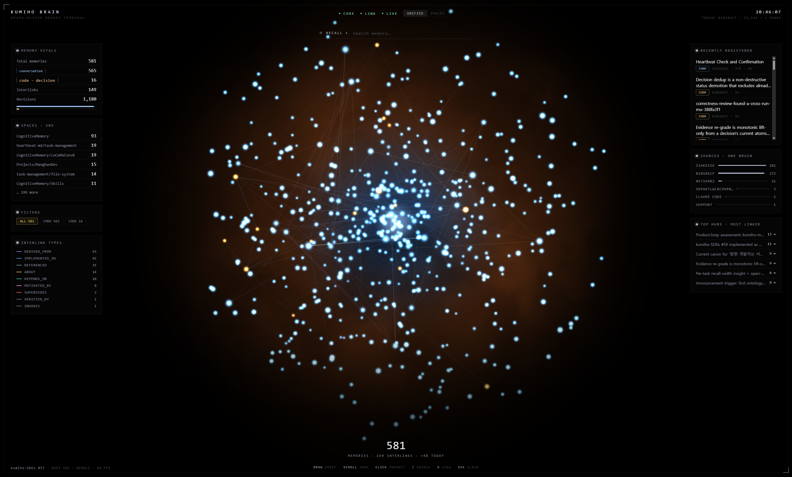

# Kumiho Brain 🦊🧠

A real-time, GPU-rendered **Second Brain** — the living Kumiho memory graph as a
slowly rotating orb of glowing memory points, growing the moment memories are
written, from any client. Implements
[kumiho-SDKs#57](https://github.com/KumihoIO/kumiho-SDKs/issues/57); evolves the
DECISION.VAULT prototype and the `docs/design/kumiho-brain-northstar.html`
look & feel into a live product. **No mock data anywhere** — everything on
screen is read from a real tenant through the Rust `kumiho` SDK.



```
dashboard/
  src/            Rust backend — axum + tokio + the `kumiho` crate (rust/)
  static/         WebGL2 frontend — no build step, no external requests
```

## Run it

```bash
cd dashboard
cargo run            # → http://127.0.0.1:8090
```

Connection follows the standard SDK bootstrap chain: bearer token from
`~/.kumiho` → control-plane discovery → your cloud tenant; with no token it
probes a loopback self-hosted CE server. Options:

```
--endpoint HOST:PORT   explicit kumiho-server (or KUMIHO_BRAIN_ENDPOINT)
--tenant SLUG          pin discovery to a tenant
--local                force the loopback self-hosted CE server
--port N               HTTP port (default 8090)
--bind ADDR            listen interface (default 127.0.0.1 — memory is private)
--key SECRET           access key for non-loopback clients (else auto-managed)
--no-auth              serve a non-loopback bind without any key (not recommended)
--edge-revs N          newest revisions per item scanned for edges (default 3, 0 = all)
--static-dir DIR       serve the frontend from disk instead of the embedded copy
                       (frontend dev without recompiling)
```

Requires `protoc` on PATH and the proto submodule
(`git submodule update --init rust/proto`) — same as building the SDK itself.

### Remote access

The dashboard serves your whole memory graph, so it only listens on loopback
by default. To reach it from another machine:

```bash
cargo run -- --bind 0.0.0.0
```

Non-loopback binds are gated behind an **access key**: `--key`/
`KUMIHO_BRAIN_KEY` if provided, otherwise one is generated and persisted at
`$KUMIHO_CONFIG_DIR/kumiho-brain.key` (mode 0600) so it stays stable across
restarts. The startup banner prints the ready-to-open URL
(`http://<lan-ip>:8090/?key=…`) — the key is needed once per browser (a
session cookie takes over, including for the WebSocket), and loopback clients
never need it. An SSH tunnel (`ssh -L 8090:127.0.0.1:8090 host`) remains the
zero-config alternative.

## What it does

- **Snapshot** — one `item_search` sweep per memory kind (`conversation`,
  `fact`, `entity` + `code_decision`, `code_anchor`, `code_evidence`; both sets
  env-configurable), then per item `get_revisions` + `get_edges` under bounded
  concurrency. Nodes are **items** (revisions are versions of the same memory);
  cross-item revision edges become typed interlinks, same-item `SUPERSEDES`
  chains surface as revision lineage in the detail card.
- **Live** — subscribes to the server `EventStream` (cursor-resumable,
  exponential-backoff reconnect). A `revision.created` upserts the node and
  pushes `node_added` / `node_updated` over the WebSocket; new memories **bloom
  into the orb** and top the "Recently registered" feed within a second or two
  of the write.
- **Render (WebGL2, pure — no libraries)** — particle drift + spring-to-anchor
  motion integrated GPU-side via **transform feedback**; points drawn as
  **instanced** billboard quads reading the TF buffer; edge lines fetch endpoint
  positions from an RGBA32F texture refreshed by a GPU→GPU `PIXEL_UNPACK` copy;
  procedural fbm nebula at half resolution; GPU color-picking for exact
  click-to-inspect. A runtime health check flips to an equivalent
  stateless-drift path if a driver mishandles TF (and under
  `prefers-reduced-motion` the scene renders on demand, without the sim).
  The M2 `readPixels` center-glow self-check logs `✓ glow verified`.
- **Audit, made fun** — typed interlinks colored per edge type with a live
  legend (real type names found in the graph), top hubs by degree,
  neighborhood highlight on selection, edge pulses when a memory is touched,
  per-space highlight/filter, search (`/`) that dims non-matches, and a detail
  card (summary · typed links you can jump along · revision lineage · tags).
- **One brain** — the Sources panel aggregates whoever actually writes
  (`source_client` metadata when present, else the author identity), and every
  filter is derived from the data — nothing is hardcoded.
- **Views** — `UNIFIED` (one sphere) ⇄ `SPACES` (a constellation: the biggest
  spaces get their own sphere, the long tail shares an "other" cluster; the
  camera reframes and the springs morph the layout live). Toggle with `V`.

## Contract (backend ↔ frontend)

`GET /api/snapshot` and the first WebSocket frame after readiness carry the
same payload:

```jsonc
{ "t": "snapshot", "generated_at": 1783932768440, "endpoint": "…",
  "spaces": [{ "id": 0, "path": "/CognitiveMemory/work" }],
  "nodes":  [{ "id": 3, "kref": "kref://…/x.conversation", "kind": "conversation",
               "item_kind": "conversation", "title": "…", "space": 0,
               "source": "Claude Code", "memory_type": "episodic",
               "created_at": "…", "updated_at": "…", "revs": 15, "seed": 687684104 }],
  "edges":  [{ "src": 3, "dst": 9, "type": "SUPERSEDES" }],
  "tenant": { "node_count": 32332, "node_limit": 1000000, "tenant_id": "…" } }
```

Stream events: `hello`, `status {core, live, info}`, `node_added`,
`node_updated`, `edge_added`, `node_removed {id}`, `heartbeat`. Detail lookups:
`GET /api/node/{id}` → node + `summary`, `tags`, `links[{type, dir, id?, title,
kref}]`, `revisions[]`. Health: `GET /api/healthz`.

`seed` is a stable FNV-1a hash of the item kref — layouts are deterministic
across reloads and clients.

## Answers to #57's open questions

1. **Live source** — the SDK *does* expose a watch: `Client::event_stream`
   (gRPC server-stream, cursor resume, `studio`-tier retention). Used directly;
   no polling needed.
2. **Repo location** — `dashboard/` in kumiho-SDKs (this directory), a
   standalone crate depending on `kumiho` by path: dogfooding the SDK from
   inside its own repo.
3. **Auth/tenant** — reuses the SDK token loader + discovery verbatim
   (`ClientBuilder::default()`); `--local` / `--endpoint` / `--tenant` override.
4. **Space→sphere at scale** — top spaces by population get spheres (≤22),
   the tail shares an "other" cluster; per-space highlight stays exact for
   every space regardless of clustering.

## SDK / server gaps found while dogfooding (per #57, filed here first)

- **No `edge.created` event.** `CreateEdge` emits nothing on the event stream
  (verified live). The dashboard compensates: each `revision.created` diffs
  that revision's edges immediately **and again ~4 s later** (writers attach
  edges right after the revision, which the immediate check can't see). A
  first-class edge event would remove the residual blind spot (edges created
  long after their revisions, between two old revisions).
- **Memories don't record their originating client.** Today's revision
  metadata has `created_by`/`username` (author identity) but nothing like
  `source_client`; the "one brain across Claude Code / Codex / Revka" story
  (M5) needs writers to stamp it. The dashboard already reads
  `source_client` | `client` | `agent` and falls back to the author, so badges
  light up as soon as writers start stamping.
- **`CreateEdge` returns only a status**, so the SDK synthesizes the `Edge`
  client-side without `created_at` — snapshot edge recency can't be shown.
- **Rust `get_item_by_kref` re-validates krefs** and rejects some
  server-accepted URIs (e.g. Unicode item names; Python 0.9.20 has the same
  issue in `get_items`). The live path degrades gracefully (derives item fields
  from the revision + event) but a `Kref::unchecked` lookup path would be
  cleaner.
- **The resolved endpoint isn't exposed on `Client`**, so the HUD can't show
  which server discovery picked without re-deriving it.

## Non-goals (v1) & notes

- Read-only: no editing/deleting memory from the dashboard.
- LOD guardrail: snapshot kinds are filtered server-side and edges scan the
  newest `--edge-revs` revisions per item; the render comfortably holds 10k+
  animated points at 60 fps on hardware GL (instancing + TF; verified ~33 fps
  even on SwiftShader software rasterization).
- WebGPU (M6 stretch) not included; the TF/instancing split keeps a future
  compute-shader path drop-in.
- The binary embeds the frontend at compile time (single-file deploy);
  `--static-dir` serves from disk for development.
